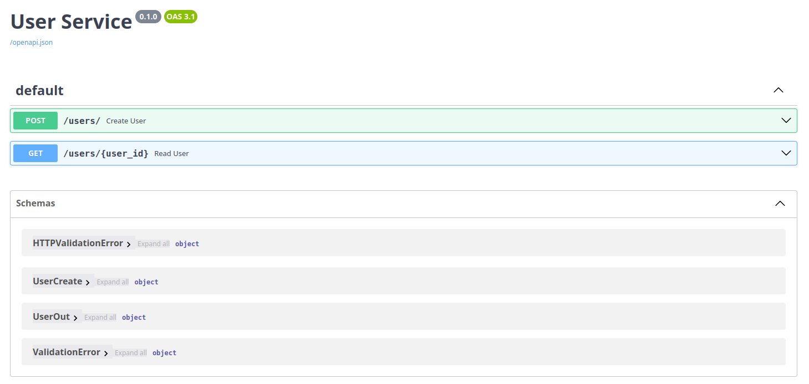
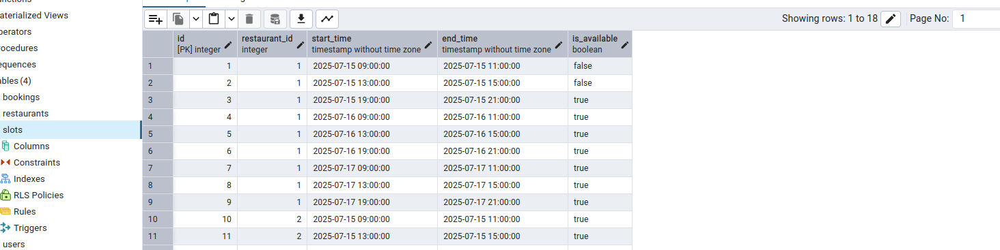
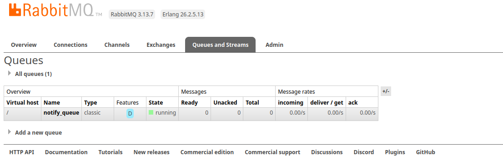
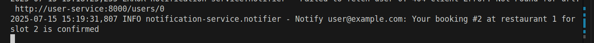

# Restaurant Reservation System

**Описание проекта**

Система **Restaurant Reservation** — это набор независимых микросервисов, объединённых в единое приложение для онлайн‑бронирования столиков в ресторане.

* **User‑service** (Python + FastAPI)
  Обрабатывает регистрацию и аутентификацию пользователей, хранит их профили в PostgreSQL.

* **Reservation‑service** (Python + FastAPI)
  Предоставляет REST API для просмотра свободных слотов и создания/отмены бронирований. Все данные о ресторанах, тайм‑слотах и бронях хранятся в PostgreSQL.

* **Notification‑service** (Python + FastAPI)
  Подписывается на события бронирования через RabbitMQ и отправляет пользователям уведомления (e‑mail, Telegram или просто лог в консоль).

* **RabbitMQ**
  Брокер сообщений на основе AMQP, через который Reservation‑service публикует события `booking.created`, а Notification‑service их потребляет.

* **PostgreSQL**
  Реляционная база данных для хранения пользователей, ресторанов, слотов и бронирований.

* **pgAdmin4**
  Веб‑панель для удобного просмотра и управления данными в PostgreSQL через GUI.

Совокупность этих компонентов позволяет надёжно и асинхронно обрабатывать бронирования, масштабировать уведомления и легко сопровождать каждый сервис независимо друг от друга.


## 📂 Проектная структура

```

.
├── docker-compose.yml            # Оркестрация контейнеров и сетей
├── notification-service          # Сервис отправки уведомлений
│   ├── Dockerfile                # Сборка образа notification-service
│   ├── requirements.txt          # fastapi, pika, python-dotenv, requests
│   └── app
│       ├── __init__.py
│       ├── main.py               # Запуск FastAPI + RabbitMQ consumer (lifespan)
│       ├── rabbit.py             # connect → declare exchange/queue → start_consuming()
│       ├── schemas.py            # Pydantic-модель BookingCreated
│       └── notifier.py           # HTTP-запрос к user-service + лог уведомления
│
├── reservation-service           # Сервис бронирования
│   ├── Dockerfile                # Сборка + entrypoint ожидания БД → seed → uvicorn
│   ├── entrypoint.sh             # wait-for-postgres → seed_data.py → uvicorn
│   ├── requirements.txt          # fastapi, sqlalchemy, psycopg2-binary, pika, python-dotenv
│   └── app
│       ├── __init__.py
│       ├── main.py               # FastAPI (CRUD эндпоинты) + swagger /docs
│       ├── models.py             # SQLAlchemy Base, Slot, Booking (+ create_all)
│       ├── schemas.py            # Pydantic‑схемы SlotOut, BookingCreate, BookingOut
│       ├── crud.py               # get_available_slots, create_booking
│       ├── rabbit.py             # publish_booking_created(event) в exchange booking_events
│       └── seed_data.py          # скрипт для «засидения» restaurants + slots
│
└── user-service                  # Сервис пользователей
    ├── Dockerfile                # Сборка + entrypoint ожидания БД → uvicorn
    ├── entrypoint.sh
    ├── requirements.txt          # fastapi, sqlalchemy, psycopg2-binary, python-dotenv
    └── app
        ├── __init__.py
        ├── database.py           # engine, SessionLocal, Base, import models
        ├── models.py             # SQLAlchemy User
        ├── schemas.py            # Pydantic UserCreate, UserOut (from_attributes)
        ├── crud.py               # create_user, get_user, get_user_by_email
        └── main.py               # FastAPI (POST /users/, GET /users/{id}) + swagger

```

---

## 🧩 Сервисы и библиотеки

| Сервис               | Python‑библиотеки (pip)                                  |
|----------------------|-----------------------------------------------------------|
| **user-service**     | fastapi, uvicorn, sqlalchemy, psycopg2-binary, python-dotenv, passlib[bcrypt] |
| **reservation-service** | fastapi, uvicorn, sqlalchemy, psycopg2-binary, pika, python-dotenv            |
| **notification-service** | fastapi, uvicorn, pika, python-dotenv, requests                        |

---

## 🚀 Запуск всей системы

1. **Склонировать репозиторий**  
   ```bash
   git clone <repo-url>
   cd restaurant-reservation
    ```

2. **Запустить стеки**

   ```bash
   docker compose up -d --build
   ```

   * Поднимутся `rabbitmq`, `postgres`, `pgadmin`, а затем сервисы.

3. **Swagger‑UI каждого сервиса**

   * **User‑service**:  [http://localhost:8001/docs](http://localhost:8001/docs)
   * **Reservation‑service**:  [http://localhost:8002/docs](http://localhost:8002/docs)
   * **Notification‑service** не имеет Swagger.

---

## 🔍 Процесс использования

1. **Регистрация пользователя**

   * **Адрес**: `POST http://localhost:8001/users/`

   * **Тело**:

     ```json
     {
       "email": "alice@example.com",
       "password": "supersecret",
       "full_name": "Alice"
     }
     ```

   * **Ответ**: `{ "id": 1, "email": "alice@example.com", "full_name": "Alice" }`

   > 

2. **Просмотр свободных слотов**

   * **Адрес**: `GET http://localhost:8002/reservations/available?restaurant_id=1`
   * **Ответ**: массив объектов SlotOut, например:

     ```json
     [
       {
         "id": 10,
         "restaurant_id": 1,
         "start_time": "2025-07-20T09:00:00Z",
         "end_time":   "2025-07-20T11:00:00Z",
         "is_available": true
       },
       …
     ]
     ```
     
     
> **Примечание по наполнению слотов:**
> Все заранее сгенерированные рестораны и их тайм‑слоты создаются скриптом `reservation-service/app/seed_data.py`.
> Если вы хотите изменить набор ресторанов, диапазоны времени или длительность слотов, просто отредактируйте соответствующие списки и логику внутри этого файла, а затем перезапустите контейнер `reservation-service` (или выполните его вручную), чтобы новые данные попали в базу.


3. **Создание брони**

   * **Адрес**: `POST http://localhost:8002/reservations/book`
   * **Тело**:

     ```json
     {
       "user_id": 1,
       "restaurant_id": 1,
       "slot_id": 10
     }
     ```
   * **Что происходит**:

     1. `reservation-service` проверяет `slots.is_available`, создаёт запись в `bookings`.
     2. Публикует событие в RabbitMQ (`exchange=booking_events`, `routing_key=booking.created`).

4. **Мониторинг в RabbitMQ**

   * **Адрес**: [http://localhost:15672](http://localhost:15672) (user/pass = user/pass)
   * **Queues** → `notify_queue`
   * **Messages** → посмотрите event в очереди
     

5. **Обработка уведомления**

   * `notification-service` слушает `notify_queue`.
   * При получении события делает `GET http://user-service:8000/users/1`, берёт email.
   * Логирует в консоль:

     ```
     Notify alice@example.com: Your booking #1 at restaurant 1 for slot 10 is confirmed.
     ```
     

## Дополнительно в проекте используются три инфраструктурных сервиса:

1. **PostgreSQL**
   – основная реляционная база данных, в которой хранятся таблицы пользователей, ресторанов, слотов и бронирований.
   – образ: `postgres:15`, порт 5432.

2. **RabbitMQ**
   – AMQP‑брокер для передачи событий между микросервисами (reservation → notification).
   – обменник `booking_events`, очередь `notify_queue`.
   – образ: `rabbitmq:3-management`, порты 5672 (AMQP) и 15672 (Management UI).

3. **pgAdmin**
   – веб‑панель управления PostgreSQL: просмотр схем, таблиц, данных и выполнение SQL‑запросов через GUI.
   – образ: `dpage/pgadmin4:latest`, порт 8080.
